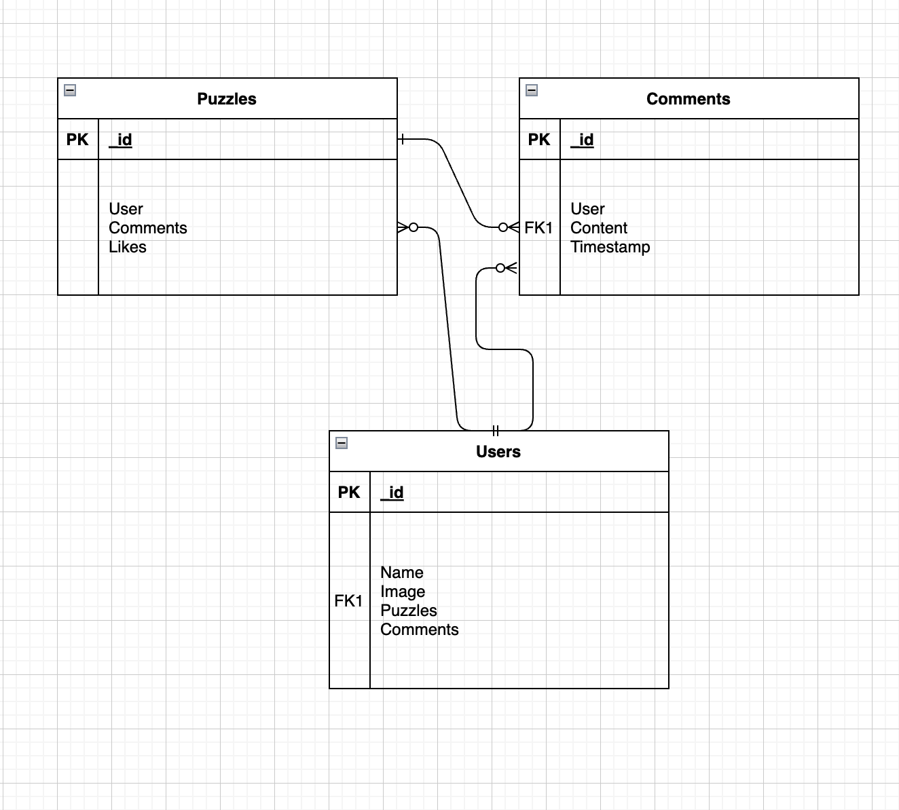

# GA-Project-2

# Title: Chuzzle

Premise: Chess puzzle app where users can play other users, or API fetched, puzzles.

#The User Story:
AAU, I want to hone my chess skills by solving puzzles.
AAU, I want to create my own puzzles for others to solve and enjoy.

# The Wireframes:

#The ERD: 

# Route Table:

# Technologies Used:
HTML, CSS, JavaScript, Canvas 

# How To Use:
Make moves on chess board, drag and drop. 

# MVP Requirements:
Models - Users, user-generate puzzles, user-generated comments, API fetched puzzles, standard games.
CReate - new puzzles. Update - existing puzzles, comments, user information. Delete - puzzles, comments.
API to fetch puzzles from website.
MongoDB stores model data and user-generated content.

# Stretch goals / ICE BOX:
voice-to-move logic using speech processing api.

