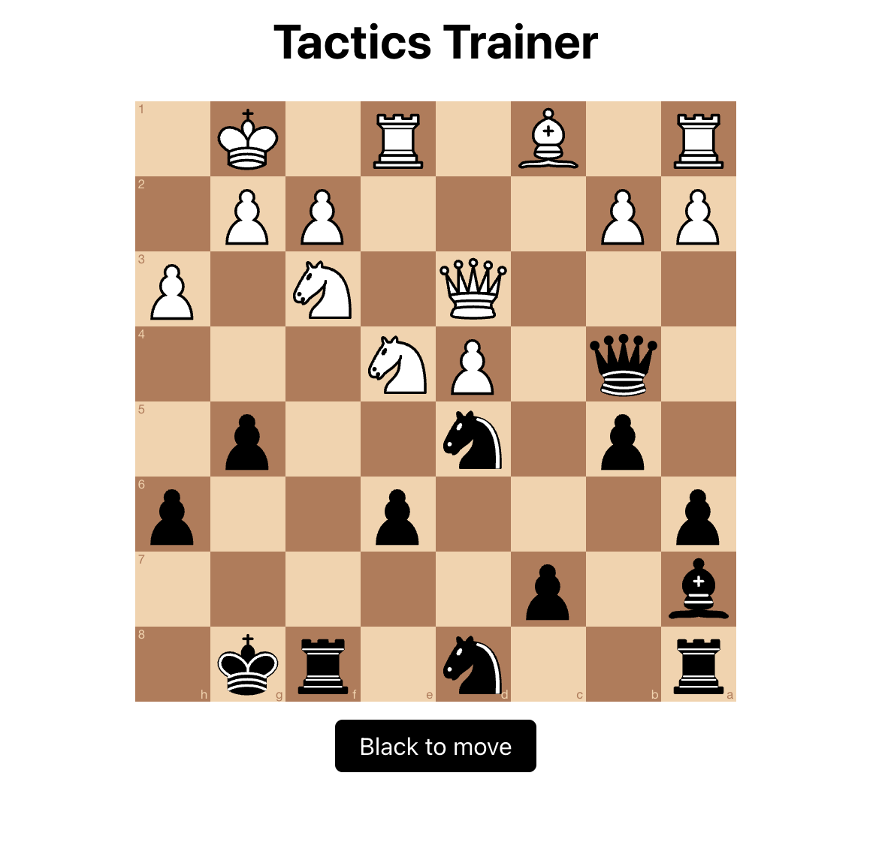
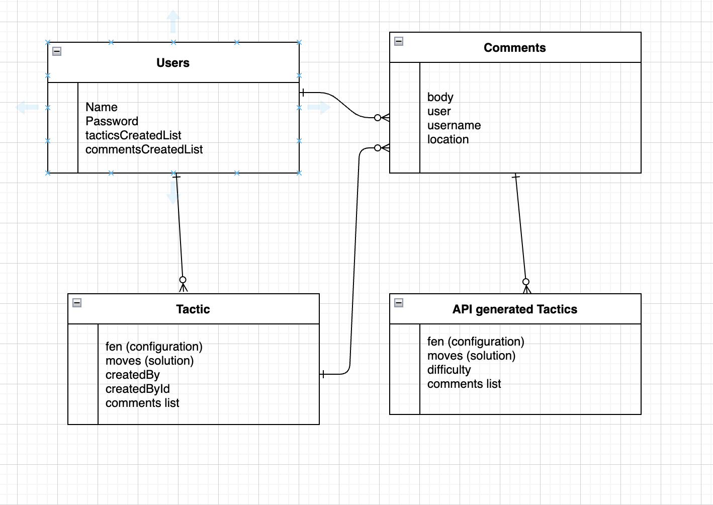
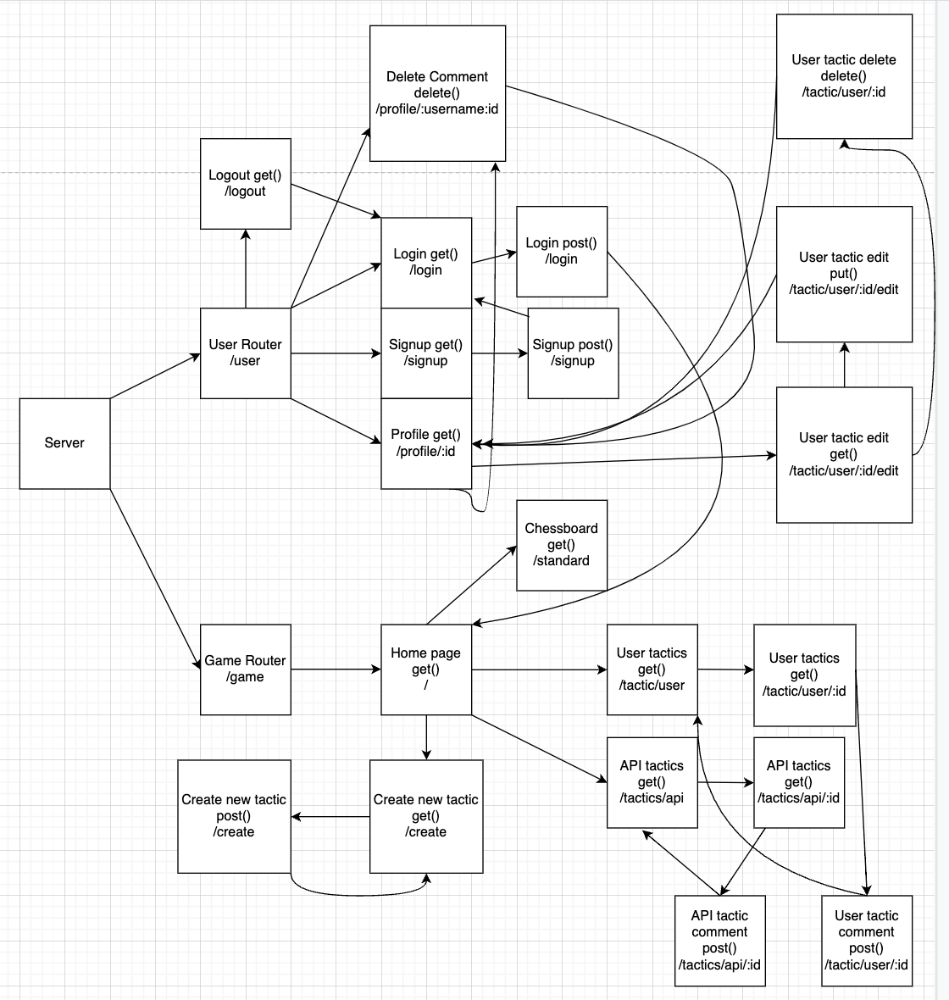

# GA-Project-2

# Title: Chuzzle
Deployed at: https://chuzzle.herokuapp.com/
Premise: Chess puzzle app where users can play other users, or API fetched, puzzles.

# The User Story:
AAU, I want to hone my chess skills by solving puzzles.
AAU, I want to create my own puzzles for others to solve or have fun with.
AAU, I want to comment on other's puzzles and be part of a community.

# The Wireframes:

# The ERD: 

# Route Table:

# Technologies Used:
HTML, CSS, JavaScript, MongoDB, Heroku

# How To Use:
Make moves on chess board, drag and drop.
To create, follow directions and record your own puzzle.

# MVP Requirements:
Models - Users, user-generate puzzles, user-generated comments, API fetched puzzles, standard games.
CReate - new puzzles, comments, users. Update - existing puzzles. Delete - puzzles, comments. Get, Post, Put, and Delete routes all hit at least once.
MongoDB stores model data and user-generated content.
API - Online tactics are generated by the Chess Puzzles api by KeeghanM. See here - https://rapidapi.com/KeeghanM/api/chess-puzzles/details

# Future Developments
Have 'replay moves' function on tactic edits.
Minor bug fixes.
Chess board logic reformatting for readability.
Score tracking - attempts/fails/etc